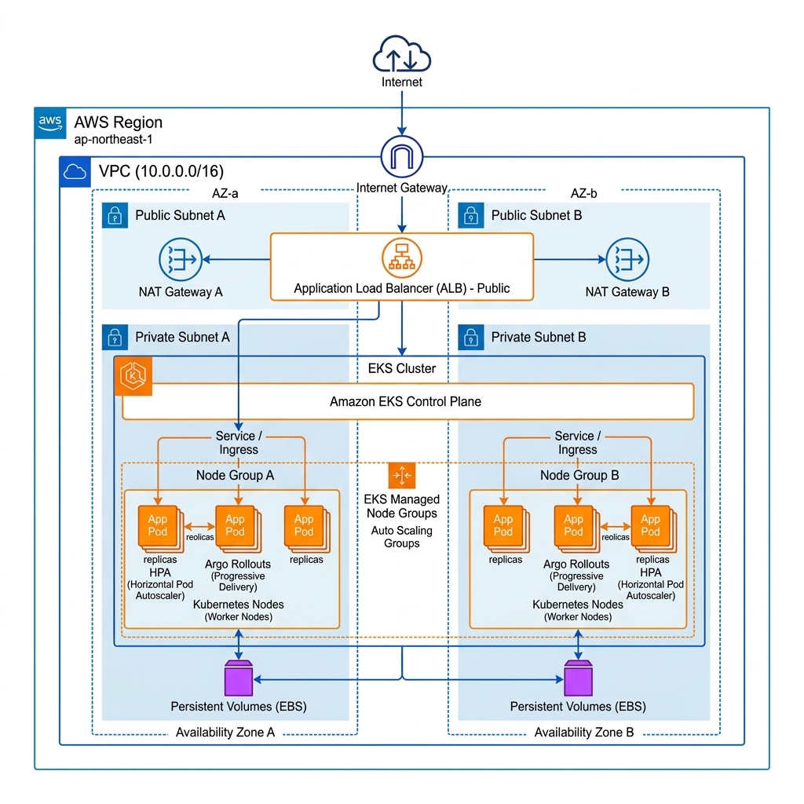

# 專案導覽與概覽 (Introduction)

本專案展示一個基於雲端原生理念構建的高可用電商基礎設施。透過 Infrastructure as Code (IaC) 與 Progressive Delivery 技術，模擬處理極端流量波動並維持服務穩定性的真實場景。

---

## 專案導覽說明

為了便於深入了解此架構，我將技術文檔分為三個階段，建議按此順序參閱：

### 1. [技術架構深度解析](./01-architecture.md)
探討 EKS 叢集設計、VPC 網路佈局以及透過 IRSA 實踐的權限控制模型。

### 2. [運維展示與實戰指南](./02-demo-guide.md)
包含自我修復、金絲雀發佈、HPA 自動擴縮與數據持久化掛載的具體展示流程。

### 3. [故障排除與技術反思](./03-reflection.md)
紀錄開發過程中遇到的 VPC 刪除死結、EBS 跨可用區限制等挑戰及其解決方案。

---

## 快速啟動指南

1. 基礎設施建置
   ```bash
   terraform init
   terraform apply -auto-approve
   ```

2. 叢集連線與應用部署
   ```bash
   aws eks --region ap-northeast-1 update-kubeconfig --name ecommerce-eks-demo
   kubectl apply -f k8s/
   ```

3. 服務狀態檢查
   ```bash
   kubectl get pods -w
   ```

---

## 專案結構說明

```text
.
├── vpc.tf                  # 網路基礎設施 (NAT, Subnets, Routing)
├── eks.tf                  # EKS 叢集與節點組管理
├── helm.tf                 # 基礎組件 (Metrics Server, Argo Rollouts)
├── cleanup.tf              # 自動化資源回收邏輯
├── k8s/                    # Kubernetes 配置檔案 (01-05 按序排列)
├── docs/                   # 專案技術文檔
│   ├── 01-architecture.md
│   ├── 02-demo-guide.md
│   └── 03-reflection.md
└── images/                 # 架構圖與技術圖表
```

---

## 系統架構圖例



---
[🏠 回到首頁](../README.md) | [➡️ 下一步：技術架構解析](./01-architecture.md)
