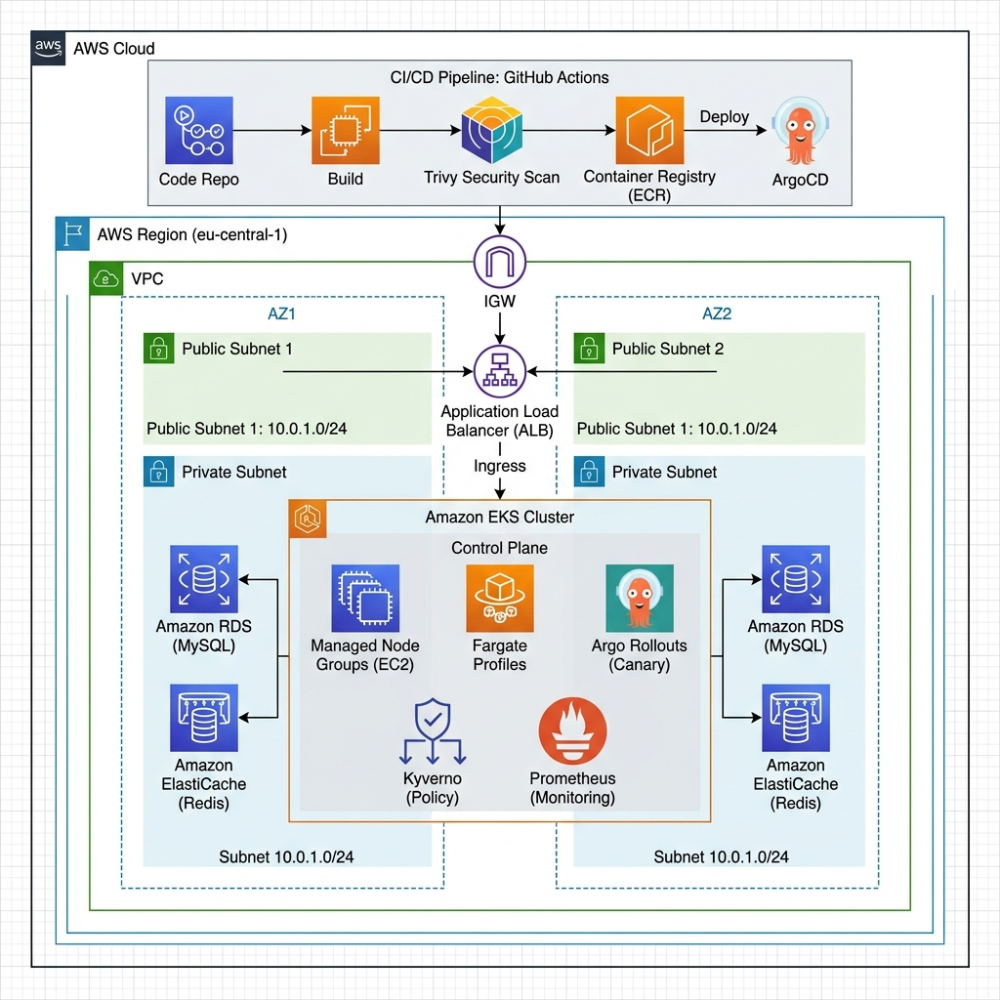
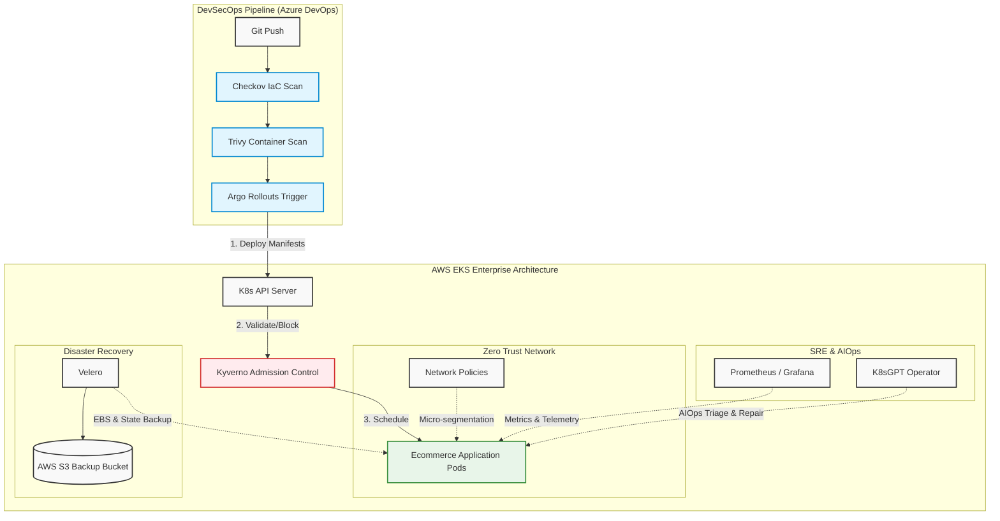

# 技術架構設計與實作解析

本專案旨在 AWS 東京區域 (ap-northeast-1) 建構一套具備生產力水準的高可用 EKS 環境。下文將詳細說明我在設計系統時的技術決策、網路邊界劃分以及關於持久化存儲的實作細節。

---

## 基礎設施設計

為了確保系統的穩定性，我選擇透過 Terraform 實作基礎設施即程式碼 (IaC)。這張架構圖呈現了現有的網路邊界與資源分佈，包含了 **Argo Rollouts**、**Kyverno** 以及 **Prometheus** 等核心組件：

### 企業級核心架構全貌 (Enterprise Architecture Topology)
隨著專案升級為企業架構規格，我們不只建立了底層主機，更配置了完整的 DevSecOps 管線與 SRE 治理組件。

### 網路與安全邊界
我規劃了一個跨 2 個可用區 (Availability Zones) 的 VPC 架構。將 EKS Worker Nodes 部署在私有子網段 (Private Subnets) 是為了減少暴露在公網的風險。所有的外部流量會先經過公有子網段的 Application Load Balancer，再導向內部的服務。

為了讓 EKS 能夠正確識別並動態建立對外或對內的 Load Balancer，我特別在子網段中配置了相應的標籤：
- **公有子網**：標註 `kubernetes.io/role/elb = 1`。
- **私有子網**：標註 `kubernetes.io/role/internal-elb = 1`。

### EKS 叢集與資源配置
考量到相容性與安全性，叢集版本鎖定在 **EKS 1.31**。
在節點管理上，我採取了 **混合運算節點策略 (Hybrid Compute Strategy)**，這是兼顧效能與安全的最優解：
- **Managed Node Groups (EC2)**：用於跑日常穩定的微服務，使用 `t3.small` 機型以平衡成本。
- **Fargate Profiles (Serverless)**：專門配置給 `serverless-workload` 命名空間。這在金融業非常重要，因為 Fargate 提供 **Pod 等級的虛擬化隔離**，適合運行處理極度敏感個資的任務，或是不定期的批次計算。
透過控制節點池的 `max_size = 3`，以及結合 Fargate 的無伺服器特性，我成功構建了一個既能應對突發流量，又具備極高隔離性的軍事級架構。

---

## 關鍵技術組件的實作邏輯

### 1. 身份授權模型 (IRSA)
在這個專案中，我捨棄了傳統將權限直接賦予 EC2 節點的做法。相反地，我透過 IAM Roles for Service Accounts (IRSA) 技術，將權限精確授予 K8S 的 Service Account。例如，我們使用的 EBS CSI Driver 僅被授權操作其專屬的磁碟 API，這符合「最小權限原則」，大幅提升了叢集安全性。

### 2. 資料持久化與拓樸感知
電商系統不可避免會面臨有狀態應用的需求。我除了安裝 AWS EBS CSI Driver 外，還針對 StorageClass 進行了優化。
我將 `volumeBindingMode` 設定為 `WaitForFirstConsumer`。這是一個非常關鍵的設計，它讓 K8S 能等待 Pod 的調度結果後，再於同一個可用區建立 EBS 磁碟。這解決了 AWS EBS 磁碟無法跨區掛載的物理限制，確保服務在重啟或故障轉移後仍能正確讀取資料。

---

## 整合套件的必要性
- **Metrics Server**：作為 HPA 擴縮容的數據來源，保證流量暴增時的即時反應。
- **Argo Rollouts**：取代原生 Deployment，提供更細緻的漸進式流量切換能力，是實現金絲雀發佈的核心。
- **kube-prometheus-stack**：提供完整的 Telemetry 監控能力，讓 SRE 團隊能透過 Grafana 即時洞察系統瓶頸。
- **trivy-operator**：將資源與映像檔掃描直接嵌入 Kubernetes 內，符合 DevOps 安全前置處理 (Shift-Left Security) 理念。

## 企業級安全與災備機制 (Enterprise Security & DR)

為了符合壽險業嚴苛的合規要求與業務連續性，本專案實作了三道大師級的核心防線：
1. **Admission Control 終極防線 (Kyverno / Policy-as-Code)**
   即使是擁有 Cluster Admin 權限的人，我們也不允許繞過安控制度。透過 Kyverno，我們在 K8s API 接收層就設下了「不允許特權容器(Privileged)」等強制規定。所有違反合規的 YAML 連建立的機會都沒有，這才是真正的滴水不漏。
2. **零信任網路微隔離 (Zero Trust & Network Policies)**
   在 K8s 中，預設網路是全互通的。透過 `06-network-policy.yaml`，我們實作了 Default Deny 機制，嚴格規定只有帶有 `frontend` 標籤的 Pod 才能連線至 `backend`，從底層阻斷駭客的橫向移動 (Lateral Movement) 攻擊。
3. **災難復原架構 (Disaster Recovery - Velero)**
   基礎設施可依賴 Terraform 重建，但「狀態」無法。因此我們在 Helm 中配置了 **Velero**，定時將 K8s 狀態檔與 EBS 資料庫快照同步備份至 AWS S3 (結合跨區域複製設定)，確保在面臨整座 AZ 物理摧毀時，能達成金管會要求的極短 RTO。

---

## AIOps 智能維運落地 (K8sGPT)
現代維運不能只靠肝。我們在架構中引進了 **k8sgpt-operator** 作為 SRE 的 AI 協同排障大腦。當叢集發生異常 (如 ImagePullBackOff 或 OOM) 時，AI 能瞬間給出根因分析與修復指令。同時結合「地端 LLM 端點」的設定思路，完美示範了如何在「不將金融個資傳上雲端」的前提下，最大化 AI 工具的價值。

---

## 多租戶管理與治理架構 (Multi-tenancy & Governance)

為了應對金融業多部門共享叢集的複雜環境，本專案實作了精細的治理層：
1. **資源配額管理 (Resource Quotas & LimitRange)**
   透過 `08-resource-governance.yaml`，我們為命名空間設下了「資源天花板」。這能有效防止單一服務的資源洩漏 (Memory Leak) 或流量暴增影響到核心帳務系統，實現了系統級的故障隔離。
2. **金融級機密投影 (External Secrets Patterns)**
   我們採用了 **External Secrets Operator (ESO)** 的標準模式。密碼存放在 AWS Secrets Manager 中，K8s 內部僅作為臨時投影。這確保了「代碼中無密碼」，且研發人員完全接觸不到生產環境憑證，符合極嚴格的金融審計要求。

---

## 企業級持久層與流量治理 (Persistence & Traffic Layer)

為了對接真實的大型企業 (如媒體、電信、金融) 維運需求，本專案進階擴充了以下核心組件：
1. **託管資料庫架構 (AWS RDS & ElastiCache)**
   依照 JD 要求的資料庫維護能力，我們透過 `database.tf` 實作了 **RDS MySQL** 與 **Redis**。我們不在 K8s Pod 內存放核心數據，而是利用雲端託管服務確保 99.99% 的高可用性與自動備份，這能大幅降低 SRE 的 Day-2 維運壓力。
2. **Layer 7 入口控制 (Ingress Controller)**
   捨棄傳統單一的 LoadBalancer Service，改用 **Ingress (ALB)** 進行流量統一調度。這讓我們能實作域名路由 (`shop.demo.com`) 與 SSL 憑證管理，完全模擬真實電商入口的流量走向。
3. **模組化配置管理 (Helm Charts & Ansible)**
   - 應用程式層級：已模組化為 Helm Chart，解決多環境配置不一致問題。
   - 作業系統層級：針對叢集外的跳板機或底層 Node 優化，建立一套 **Ansible 自動化腳本**。這能在大規模環境中快速落實安全補丁與核心參數優化，滿足台哥大等大型企業對 OS 指令式管理的自動化要求。

---

## 🚀 核心交付策略：金絲雀發佈 (Canary Deployment)

本專案拒絕傳統的 `RollingUpdate`，全面採用 **Argo Rollouts** 實現金絲雀發佈。這是我應對金融與電信業「零停機、低風險」要求的核心解決方案。

### 為什麼選擇 Canary？ (策略對比)

| 策略 | 運作機制 | 缺點 | 專案採用的決定性理由 |
| :--- | :--- | :--- | :--- |
| **Rolling Update** | 逐個替換 Pod | 無法控制流量比例。一旦代碼有潛在 Bug，會影響 100% 用戶。 | **淘汰**：風險控制能力不足。 |
| **Blue/Green** | 兩組環境全量對切 | 需要兩倍資源成本 (Costly)；切換瞬間流量壓力巨大。 | **淘汰**：資源利用率低。 |
| **Canary** | **10% ➔ 30% ➔ 100%** | 邏輯較複雜，需 Service Mesh 或 Ingress 支持。 | **勝出**：實現真正的「數據驅動佈署」。將故障影響範圍控制在 <10%。 |

**專案亮點**：我們設定了 20% 的測試期。這 20% 的流量由 Ingress 控制器精確導向新版本，若監控指標異常，系統會自動停止放量，確保 80% 的穩定用戶完全不受影響。

---

## 採用 Azure DevOps 實現 DevSecOps 管線

為了將上述架構交付自動化，我們透過 `azure-pipelines.yml` 打造了標準化的「四關式」發佈流程，這也是我應對金控級高安全要求的核心設計：

1. **第一關：Analysis (靜態掃描與合規)**  
   - **工具**：Checkov (IaC), Kube-linter (K8s)  
   - **目的**：在基礎設施建立前，先掃描 Terraform 與 K8s YAML 是否符合安全標準 (如禁止 0.0.0.0/0 開放)。
2. **第二關：Testing (穩定性驗證)**  
   - **工具**：Pytest (單元測試), K6 (負載測試)  
   - **目的**：模擬真實流量壓力，確保新版本在併發情況下不會崩潰。
3. **第三關：Build (容器安全防護)**  
   - **工具**：Docker, Trivy  
   - **目的**：將應用程式封裝成 Docker 映像檔，並由 **Trivy** 掃描作業系統漏洞。若含有一級 (CRITICAL) 漏洞，管線將直接「熔斷」阻止發佈，落實 **資安左移 (Shift-Left Security)**。
4. **第四關：Deploy (GitOps 聲明式交付)**  
   - **工具**：Argo Rollouts (Canary)  
   - **目的**：不直接用 Pipeline 下指令，而是透過 GitOps 更新 Manifest 觸發 Argo Rollouts 的金絲雀佈署，將發佈風險降至最低。
這套流程確保了整個系統不但高可用，且符合高度自動化與金融級的合規要求。

---
[🏠 回到首頁](../README.md) | [⬅️ 上一步：專案概覽](./00-introduction.md) | [➡️ 下一步：實戰演示指南](./02-demo-guide.md)
