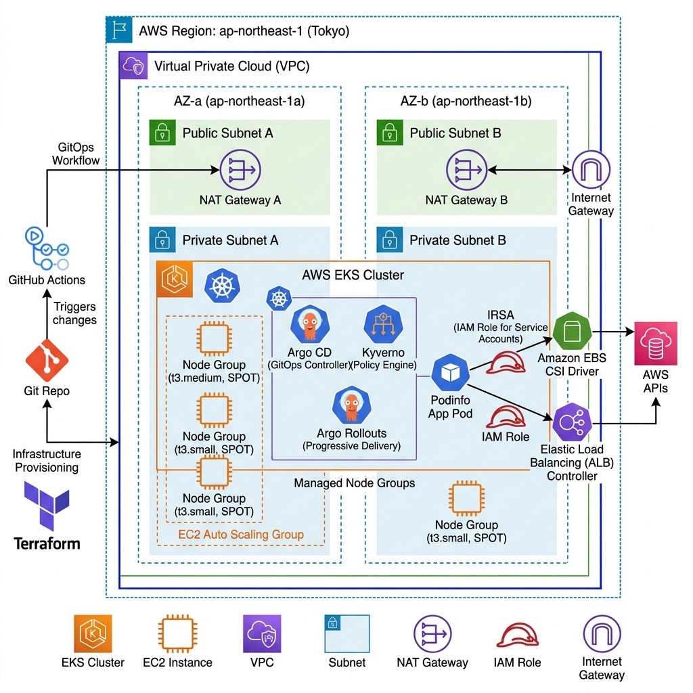

# 🏗️ 專案架構與技術決策 (Project Architecture & Technical Merits)

本文件整合了本專案的基礎設施藍圖、DevSecOps 治理策略與各項技術選型的深度解析。目標在於展示一個具備生產級別 (Production-Ready) 的 EKS 雲端架構設計。

## 🌟 核心架構亮點 (Technical Merits)

### 1. 零信任與多層次安全防禦 (Defense-in-Depth)
*   **基礎網路隔離**：透過 VPC 將 EKS Worker Nodes 放置於 Private Subnet，阻斷外部直接存取。
*   **Kubernetes 網路微隔離 (Network Policies)**：實作 Default Deny 原則，僅允許授權的 Pod 互相通訊。
*   **准入控制與政策即代碼 (Kyverno)**：在 API Server 階段攔截非授權映像檔與特權容器 (Privileged Containers)，從源頭斬斷漏洞。
*   **持續自動化掃描 (Trivy + GitHub Actions)**：實現「左移資安 (Shift-Left)」，在 CI 階段與 Runtime 階段雙重封殺已知漏洞 (CVE)。

### 2. 高可用性與雲端 API 整合 (HA & AWS API Integration)
*   **多可用區部署 (Multi-AZ)**：底層 VPC 與 EKS 跨多個 AZ 部署，避免單一資料中心故障導致停機。
*   **IAM Roles for Service Accounts (IRSA)**：這是本專案的核心安全亮點。我們不使用寬鬆的 Node IAM Role，而是透過 OIDC 供應商將 IAM Role 直接綁定到 K8s Service Account。例如，`aws-ebs-csi-driver` 僅具備操作 EBS 的權限，實現了「最小權限原則 (Principle of Least Privilege)」的雲端 API 呼叫。
*   **彈性與負載平衡**：結合 AWS ALB/NLB 與 Kubernetes HPA，透過 AWS Load Balancer Controller 自動化管理雲端網路資源。
*   **儲存高可用 (AWS EBS CSI)**：利用 `WaitForFirstConsumer` 策略，確保 Pod 與資料磁碟的 AZ 對齊，防止資料庫 Pod 調度失敗。

### 3. 持續交付與 GitOps (Continuous Delivery)
*   **唯一真相來源 (Single Source of Truth)**：透過 Argo CD 實現基礎設施狀態與 GitHub 儲存庫的強制同步。
*   **配置偏移修復 (Drift Detection)**：當線上環境遭到人為篡改時，Argo CD 會在 3 分鐘內自動將環境修復回 Git 上的原始設定。
*   **漸進式交付 (Argo Rollouts)**：實施金絲雀發布 (Canary Deployments)，精準控制「爆炸半徑」，並支援秒級回滾。

---

## 🛠️ 架構演進與技術選型 (Evolution & Choices)

在建置此專案時，我面臨了多種技術選擇，以下為最終選型的商業與技術考量：

### IaC 工具：Terraform vs CloudFormation
*   **選型決定**：Terraform
*   **考量點**：雖然 AWS CloudFormation 與 AWS 整合度最高，但 Terraform 擁有廣泛的社群與多雲支援能力。使用 Terraform 不僅能展現跨平台能力，其強大的模組化 (Modules) 與狀態機 (State Machine) 管理也更符合現代企業架構。

### 持續交付：Argo CD vs Jenkins
*   **選型決定**：Argo CD (GitOps)
*   **考量點**：傳統的 Push-based CI/CD (如 Jenkins) 需要將 K8s 的高權限憑證存放在外部 CI 伺服器，安全風險極高。Argo CD 採用 Pull-based 模型，部署於叢集內部主動拉取 Git 配置，不僅解決了憑證外洩風險，也帶來了強大的自癒與配置修復能力。

### 原生部署工具：Kustomize vs Helm
*   **選型決定**：Kustomize (專案最終重構選用)
*   **考量點**：Helm 適合打包第三方程式庫 (如 Redis、Argo)，但對於內部微服務，Kustomize 的 Base & Overlays 架構更加輕量。它無需編寫複雜的 Go Template，即可透過 Patch 的方式優雅地管理 Dev、Staging 與 Prod 的環境差異，大幅降低了維護成本。

### 安全政策引擎：Kyverno vs OPA Gatekeeper
*   **選型決定**：Kyverno
*   **考量點**：OPA Gatekeeper 需要學習專屬的 Rego 語言，學習曲線陡峭。Kyverno 採用 K8s 原生的 YAML 格式編寫政策，維運團隊可快速上手，且其攔截與生成能力完美符合企業敏捷資安的需求。

---

## 🔒 合規性與進階治理 (Governance)

為因應嚴格的企業合規要求（例如：金融法規或 ISO 27001），本平台具備以下進階治理能力：
1. **作業系統加固 (Ansible Node Hardening)**：透過 Ansible 在 EC2 啟動時自動關閉危險端口、提升網路連線參數，並確保 SSM Agent 啟用以供無密碼安全審計。
2. **IaC 靜態安全掃描 (Checkov)**：在 GitHub Actions 中強制執行 Checkov，防止工程師提交例如「開啟 Public Access 的 S3」或「未加密的 EBS」等高危險代碼。